# quarkus-eclipse

> Quarkus Eclipse - Supersonic Subatomic Java in your Eclipse IDE

Quarkus Eclipse contains tooling to make it easier to work with the [Quarkus](https://quarkus.io) project in the [Eclipse](https://www.eclipse.org) IDE.

## Build Instructions

You will need to have Maven installed. You can build the project by issuing `mvn clean verify`. 

When the build finishes you will find an installable Eclipse repository in the `repository/io.quarkus.eclipse.repository/target` folder. 

The name of the repository is `io.quarkus.eclipse.repository-x.y.z-SNAPSHOT.zip`

## Installation Instructions

Launch Eclipse to perform the installation of the freshly built repository.

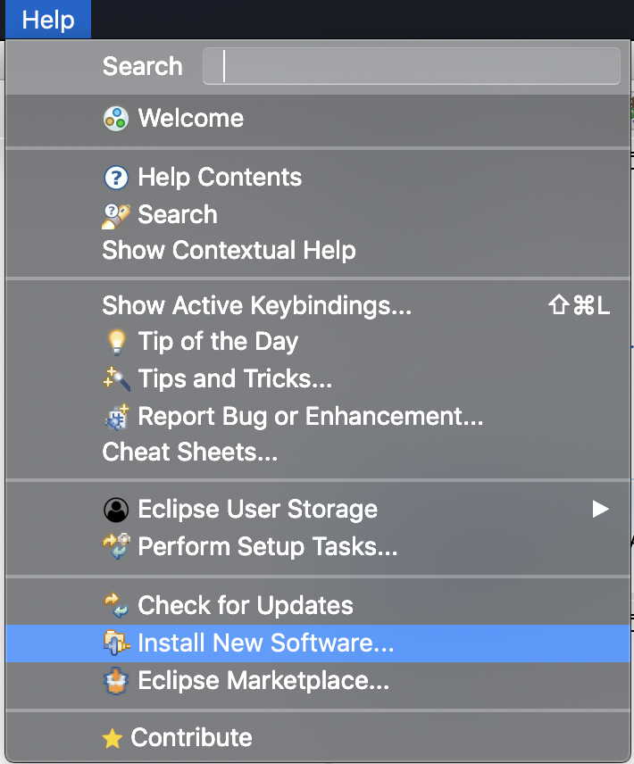

Select the `Help->Install New Software...` menu to bring up the installation wizard.

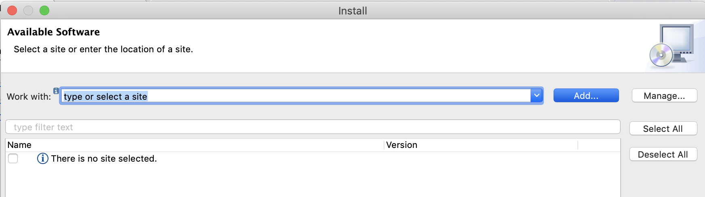

Push the `Add...` button to bring up the `Add Repository` dialog.

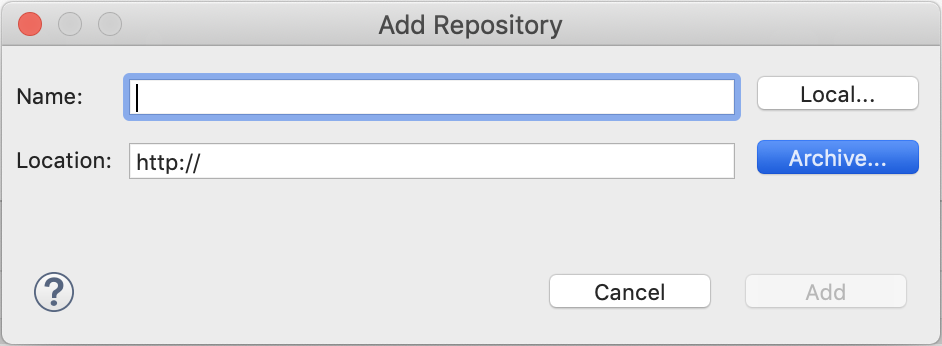

Push the `Archive...`button and navigate to the zip file containing the repository.

Push the `Open` button. The `Location` text field now contains the location of your archive. 

Push the `Add` button to close the dialog. 

The `Install` wizard now contains the `Quarkus` repository and feature. Push the `Select All` button and then `Next` to pass to the installation details page of the wizard.

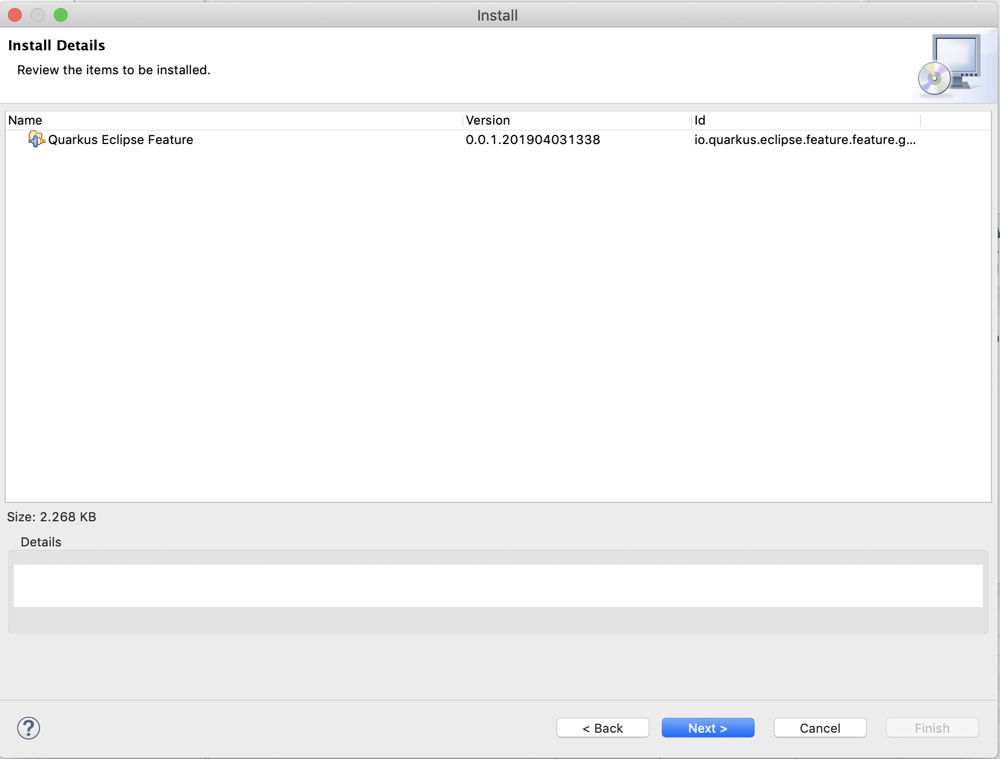

Push the `Next` button once again to pass to the license page of the wizard.

Accept the license to enable the `Finish` button that you need to push subsequently. A dialog opens warning you that you are installing unsigned content.

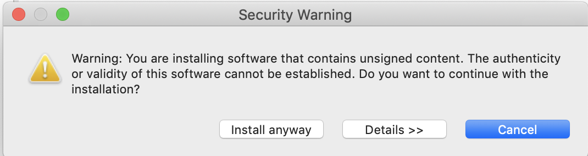

Ignore the warning and push the `Install anyway` button. Eventually a new dialog window will open asking you to apply the changes by restarting Eclipse.

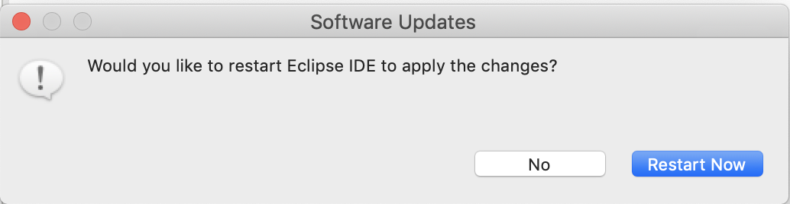

Finish the installation by selecting `Restart Now`.

## Getting Started

Now that you have succesfully installed the Quarkus plugins into your Eclipse workbench, it is time to use the available functionality.

### The Quarkus Perspective

There is a `Quarkus` perpective that brings the currently available functionality together.

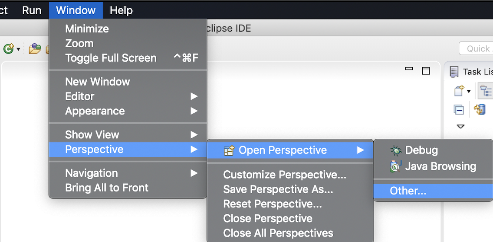

Select the `Window->Perspective->Open Perspective->Other...` menu item to bring up the `Open Perspective` dialog.

Select `Quarkus` and push the `Open` button to open the perspective.

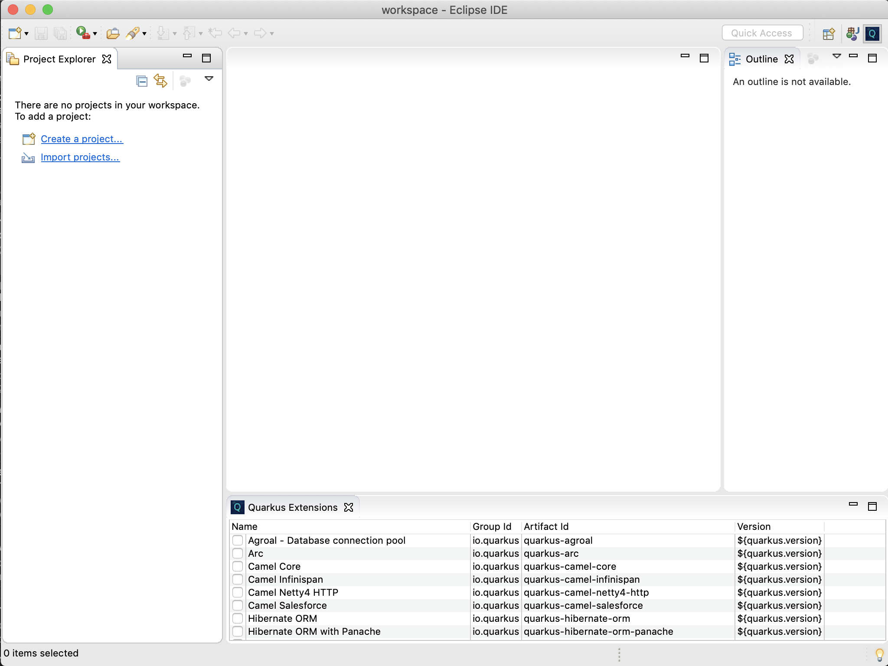

As you can see there is a `Quarkus Extensions` view in this perspective, containing a list of all the available Quarkus extensions.

### Create Quarkus Project

The next step would be to create a Quarkus project in your workspace. 

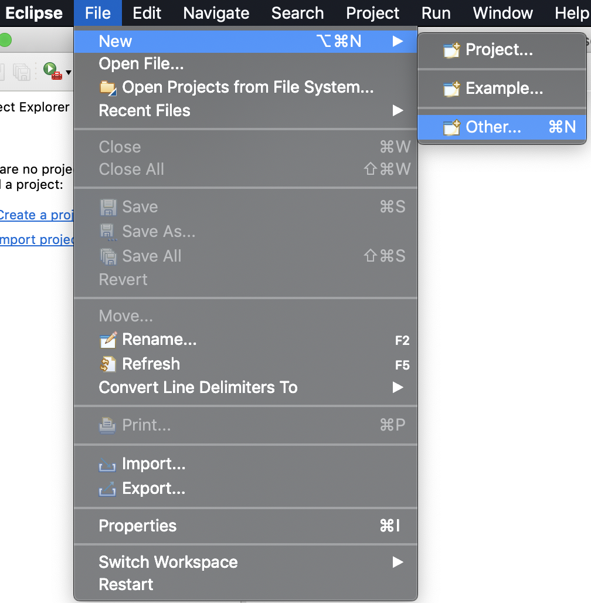

Select the `File->New->Other...` menu item to bring up the `New` dialog.

 

In this dialog, select `Quarkus->Create New Quarkus Project` and push the `Next` button to launch the `New Quarkus Project` wizard.

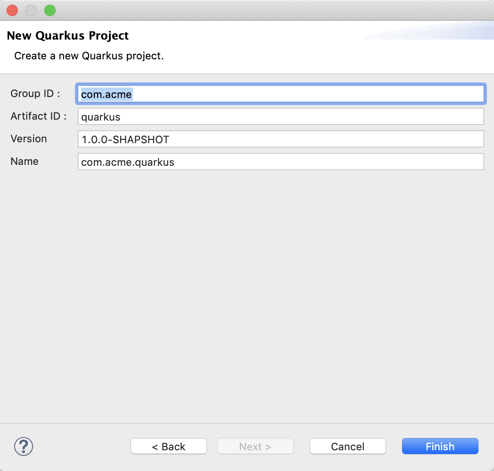

Fill out the details for your project and push the `Finish` button to close the wizard and create your new Quarkus project.

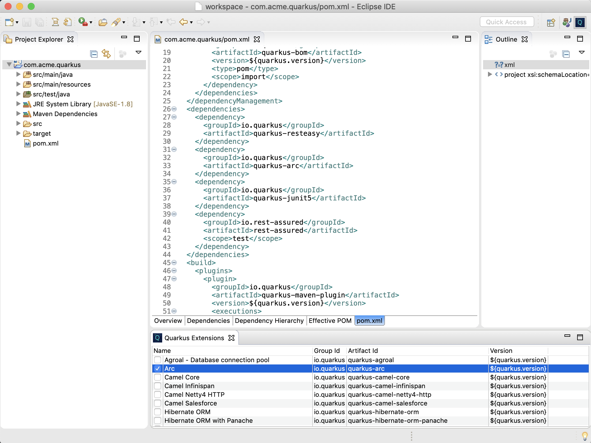

Observe that in the `Quarkus Extensions` view, the checkboxes next to the already installed extensions are selected.
 

