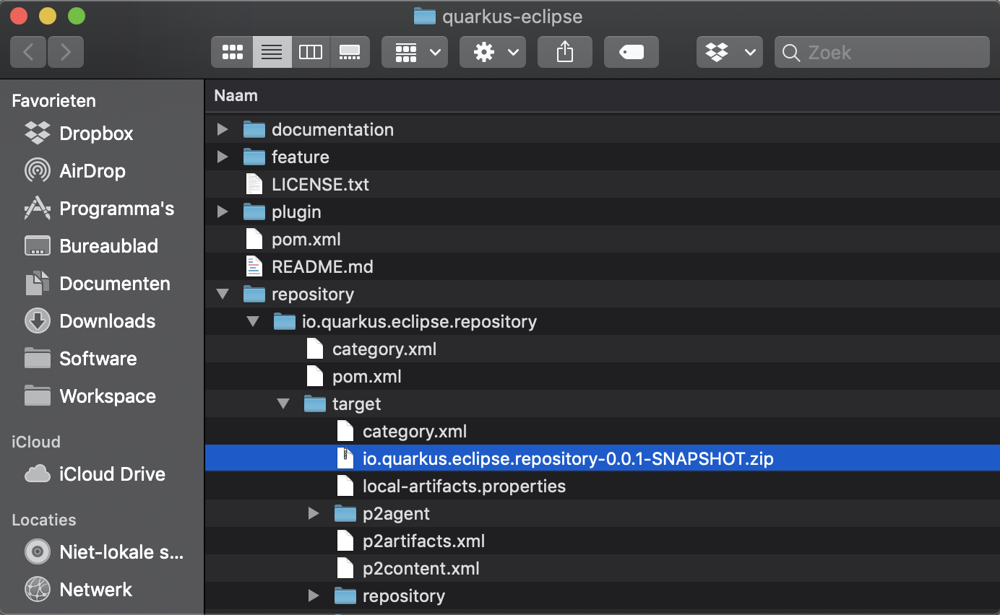

<!--
  ~ Copyright 2019 Red Hat, Inc.
  ~
  ~ Licensed under the Apache License, Version 2.0 (the "License");
  ~ you may not use this file except in compliance with the License.
  ~ You may obtain a copy of the License at
  ~
  ~     http://www.apache.org/licenses/LICENSE-2.0
  ~
  ~ Unless required by applicable law or agreed to in writing, software
  ~ distributed under the License is distributed on an "AS IS" BASIS,
  ~ WITHOUT WARRANTIES OR CONDITIONS OF ANY KIND, either express or implied.
  ~ See the License for the specific language governing permissions and
  ~ limitations under the License.
  -->

# Building Quarkus Eclipse

You will need to have Maven installed. You can build the project by issuing `mvn clean verify`. 

When the build finishes you will find an installable Eclipse repository in the `repository/io.quarkus.eclipse.repository/target` folder. 

The name of the repository is `io.quarkus.eclipse.repository-x.y.z-SNAPSHOT.zip`.

Now you can proceed with the installation of your repository in your Eclipse workbench by following the [installation instructions](../installation/install.md).
