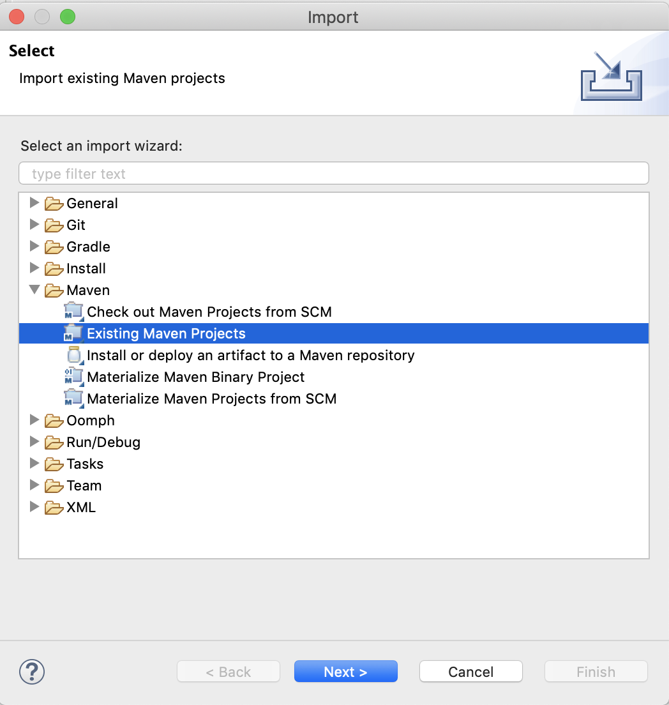
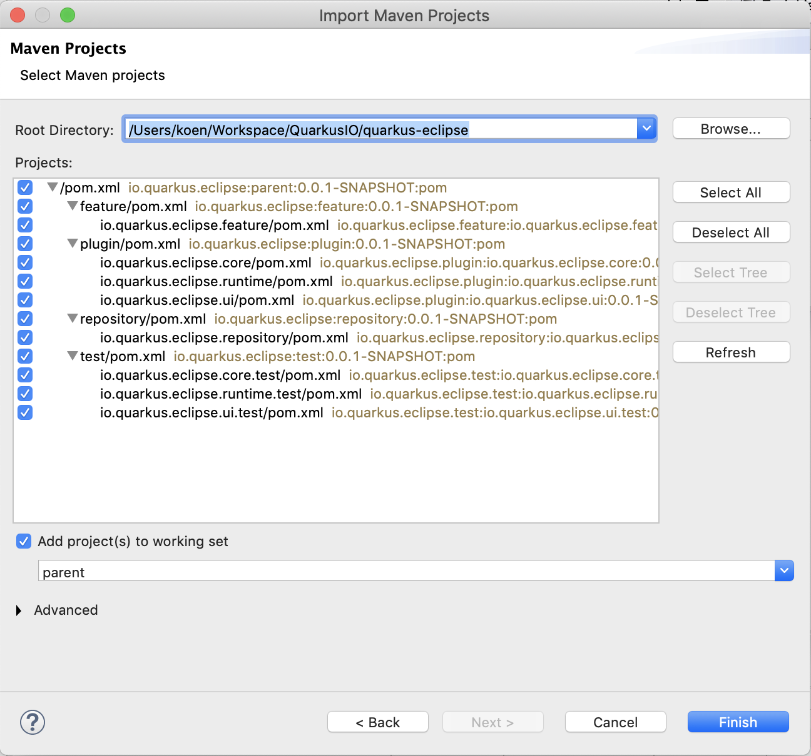

# Contribution guide

**Want to contribute? Great!** 
We try to make it easy, and all contributions, even the smaller ones, are more than welcome.
This includes bug reports, fixes, documentation, examples... 
But first, read this page (including the small print at the end).

## Legal

All original contributions to Quarkus are licensed under the
[ASL - Apache License](https://www.apache.org/licenses/LICENSE-2.0),
version 2.0 or later, or, if another license is specified as governing the file or directory being
modified, such other license.

All contributions are subject to the [Developer Certificate of Origin (DCO)](https://developercertificate.org/).
The DCO text is also included verbatim in the [dco.txt](../../dco.txt) file in the root directory of the repository.

## Reporting an issue

This project uses GitHub issues to manage the issues. Open an issue directly in GitHub.

If you believe you found a bug, and it's likely possible, please indicate a way to reproduce it, what you are seeing and what you would expect to see.
Don't forget to indicate your Java and Eclipse version. 

## Before you contribute

To contribute, use GitHub Pull Requests, from your **own** fork.

### Import the Projects

The different projects constituting the Quarkus Eclipse tooling can be imported in your Eclipse workspace by using the Eclipse import wizard. Bring up the wizard by selecting `File->Import...`

Select the `Maven->Existing Maven Projects` wizard and push the `Next` button.

Push the `Browse...` button and navigate to the root of your quarkus-eclipse clone. Perform the import by pushing the `Finish` button.

## The small print

This project is an open source project, please act responsibly, be nice, polite and enjoy!
