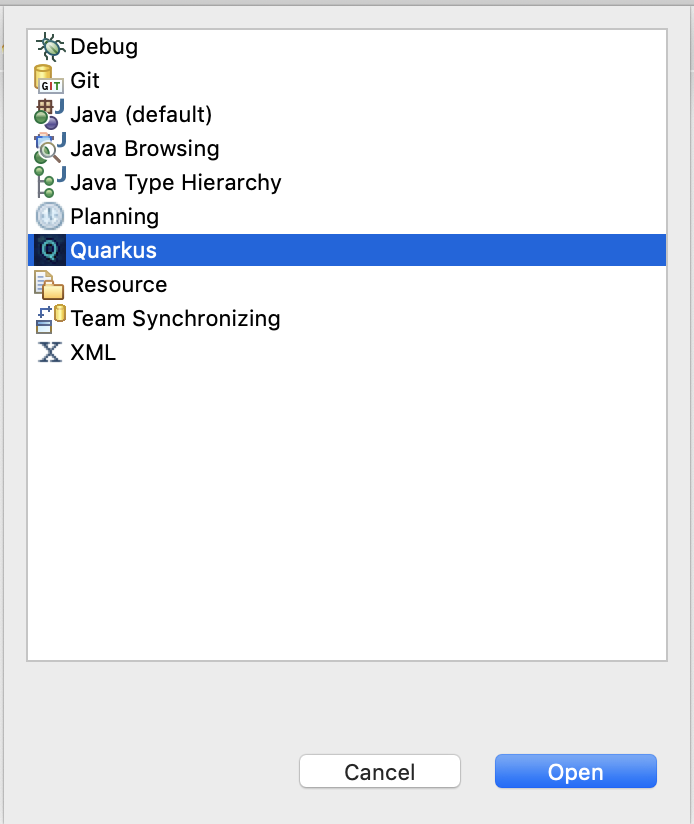
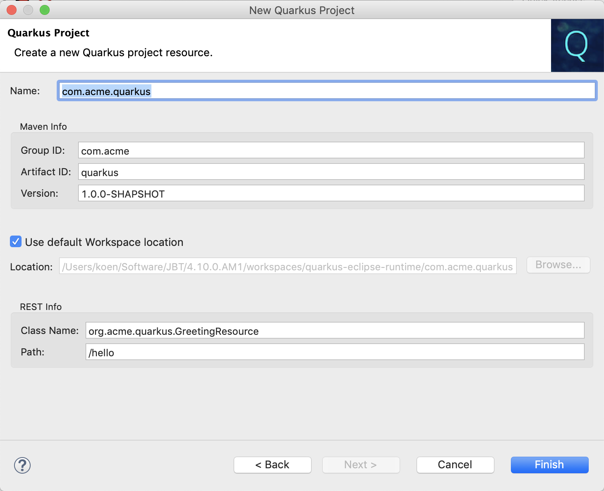

# Getting Started Guide

To follow the getting started guide you will need to have the Quarkus plugins installed in your Eclipse workbench. You can build an installable repository by following the [build instructions](../building/build.md). After building, use the [installation guide](../installation/install.md) to perform the installation.

## The Quarkus Perspective

There is a `Quarkus` perpective that brings the currently available functionality together.

Select the `Window->Perspective->Open Perspective->Other...` menu item to bring up the `Open Perspective` dialog.

Select `Quarkus` and push the `Open` button to open the perspective.

As you can see there is a `Quarkus Extensions` view in this perspective, containing a list of all the available Quarkus extensions.

## Create Quarkus Project

The next step would be to create a Quarkus project in your workspace. 

Select the `File->New->Other...` menu item to bring up the `New` dialog.

 

In this dialog, select `Quarkus->Create New Quarkus Project` and push the `Next` button to launch the `New Quarkus Project` wizard.

Fill out the details for your project and push the `Finish` button to close the wizard and create your new Quarkus project.

Observe that in the `Quarkus Extensions` view, the checkboxes next to the already installed extensions are selected.
 
## Install New Extension

You can add a new Quarkus extension to your project from teh `Quarkus Extensions` view.

Simply select the extension you want to add and bring up the context menu by right-clicking. Then push the `Install Extension` menu item.

Observe that the newly installed extension is now checked in the `Quarkus Extensions` view and that a new dependency has been added to the `pom.xml` file.