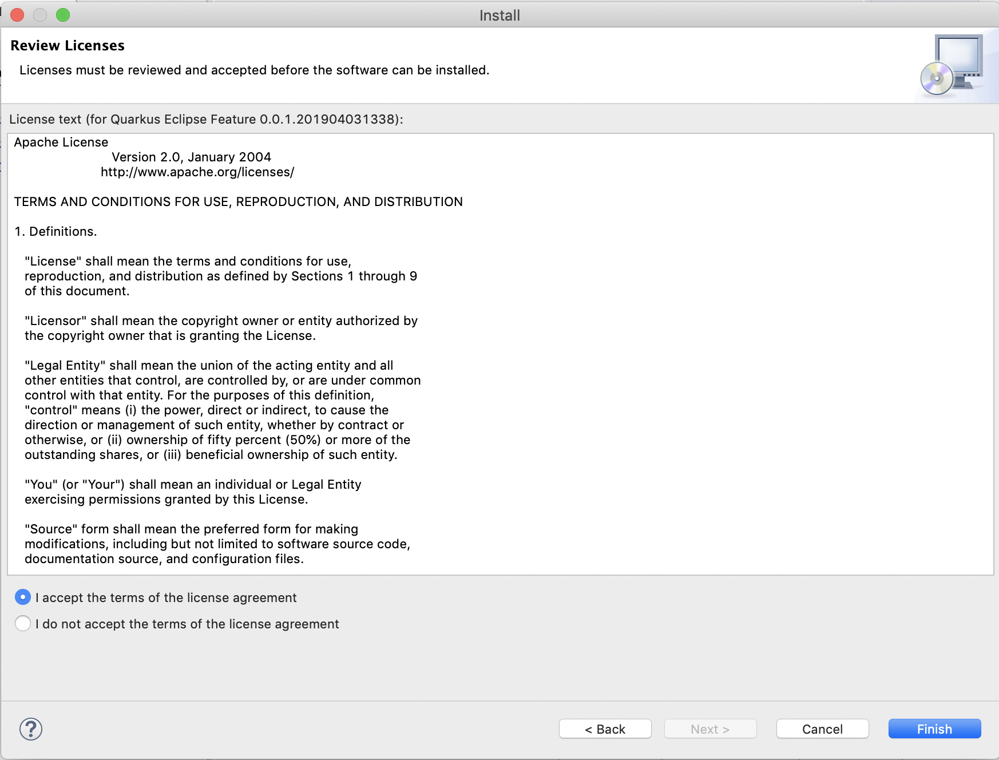

# Installation Guide

Launch Eclipse to perform the installation of the repository. If you don't have a repository yet, you can build it by following the [build instructions](../building/build.md).

Select the `Help->Install New Software...` menu to bring up the installation wizard.

Push the `Add...` button to bring up the `Add Repository` dialog.

Push the `Archive...`button and navigate to the zip file containing the repository.

Push the `Open` button. The `Location` text field now contains the location of your archive. 

Push the `Add` button to close the dialog. 

The `Install` wizard now contains the `Quarkus` repository and feature. Push the `Select All` button and then `Next` to pass to the installation details page of the wizard.

Push the `Next` button once again to pass to the license page of the wizard.

Accept the license to enable the `Finish` button that you need to push subsequently. A dialog opens warning you that you are installing unsigned content.

Ignore the warning and push the `Install anyway` button. Eventually a new dialog window will open asking you to apply the changes by restarting Eclipse.

Finish the installation by selecting `Restart Now`.

You can now create your first Quarkus project by following the [getting started guide](../getting-started/getting-started.md).

